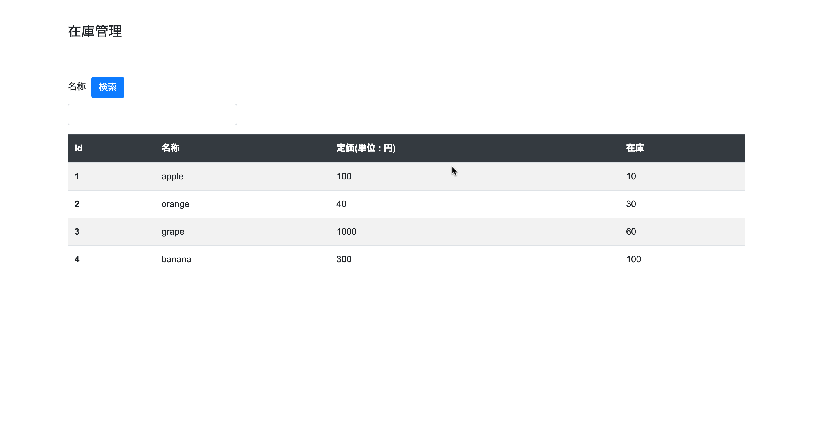
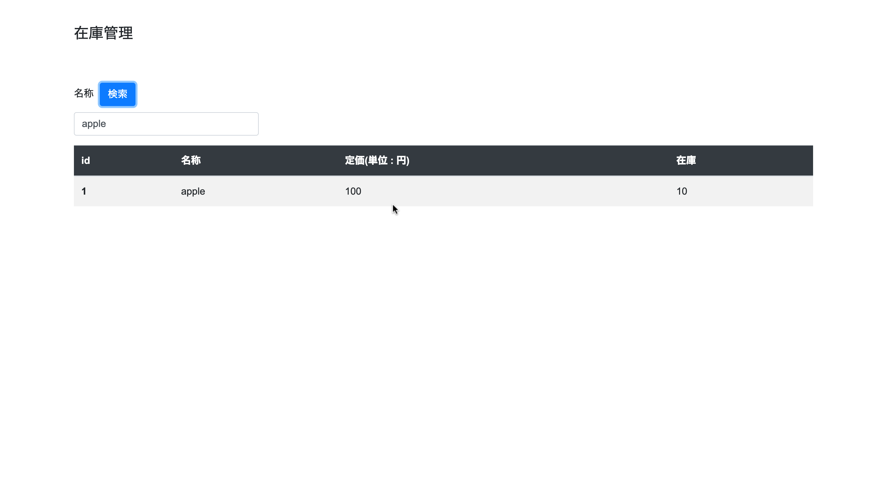
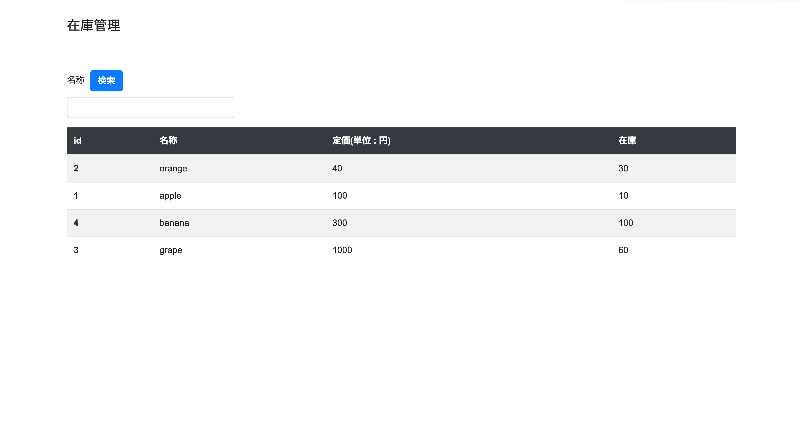

# インタラクティブな表をネイティブjavascriptで実装

## 準備

まず今回用にjsプロジェクトを作成します.

```
mkdir interactive-table
cd interactive-table
npm init 
```

またコンテンツ格納用のフォルダを作成します.
```
mkdir public
mkdir public/style
mkdir public/js
```

--- 

##  HTML/CSS

最低限のhtmlとcssを記述

- public/index.html

```html
<!DOCTYPE html>
<html>
<head>
<title>intaractibe table</title>
<meta charset="utf-8">
<!-- bootstrap css読み込み -->
<link rel="stylesheet" href="https://stackpath.bootstrapcdn.com/bootstrap/4.3.1/css/bootstrap.min.css" integrity="sha384-ggOyR0iXCbMQv3Xipma34MD+dH/1fQ784/j6cY/iJTQUOhcWr7x9JvoRxT2MZw1T" crossorigin="anonymous">
<link rel="stylesheet" href="style/default.css">
<link rel="shortcut icon" href="">
</head>
<body>
<div class="contents-wrapper">
    <div class="header">
      <p>在庫管理</p></br>
    </div>
    <div class="form-group">
      <label for="item_name">名称</label><button type="button" class="btn btn-primary">検索</button>
      <input type="text" id="item_name" class="form-control">
    </div>
    <div class="table-wrapper">
        <table class="table table-striped">
            <thead class="table-dark">
              <tr class="row-header">
                <th scope="col" data-colName="id">id</th>
                <th scope="col" data-colName="name">名称</th>
                <th scope="col" data-colName="unit_price">定価(単位 : 円)</th>
                <th scope="col" data-colName="stock">在庫</th>
              </tr>
            </thead>
            <tbody class="items">
            </tbody>
          </table>
    </div>
</div>
<!-- bootstrap読み込み -->
<script src="https://code.jquery.com/jquery-3.3.1.slim.min.js" integrity="sha384-q8i/X+965DzO0rT7abK41JStQIAqVgRVzpbzo5smXKp4YfRvH+8abtTE1Pi6jizo" crossorigin="anonymous"></script>
<script src="https://cdnjs.cloudflare.com/ajax/libs/popper.js/1.14.7/umd/popper.min.js" integrity="sha384-UO2eT0CpHqdSJQ6hJty5KVphtPhzWj9WO1clHTMGa3JDZwrnQq4sF86dIHNDz0W1" crossorigin="anonymous"></script>
<script src="https://stackpath.bootstrapcdn.com/bootstrap/4.3.1/js/bootstrap.min.js" integrity="sha384-JjSmVgyd0p3pXB1rRibZUAYoIIy6OrQ6VrjIEaFf/nJGzIxFDsf4x0xIM+B07jRM" crossorigin="anonymous"></script>
<script src="js/app.js"></script>
</body>
</html>
```

- public/style/default.css

```css
body {
    font-family: Arial, Helvetica, sans-serif;
    font-size: 16px;
}

.header {
    margin-top: 40px;
    font-size: 24px;
}

.contents-wrapper {
    padding-left: 120px;
    padding-right: 120px;
}

button {
    margin: 10px;
}

.form-control {
    width: 300px;
}
```

--- 

## 静的な表を出力

テーブルの全レコードは配列として`TableModel`の`data`として管理します. 
また表示するテーブルのレコードは`tableItems`で管理するようにし, 
`TableView`側で`tableItems`を元にHTML文字列を組み立てを行い描画すれば表の出力ができます.

- public/js/app.js

```js
const items = [
    {id:1, name:'apple', unit_price:100, stock:10},
    {id:2, name:'orange', unit_price:40, stock:30},
    {id:3, name:'grape', unit_price:1000, stock:60},
    {id:4, name:'banana', unit_price:300, stock:100},
]

class TableModel {
    constructor(data) {
        this.data = data;
        this.tableItems = data;
        this._listeneres = {'search':[], 'sort':[]};
    }
    /**
     * イベントの登録を行う
     * @param {*} type イベント
     * @param {*} callback イベントハンドラ
     */
    on(type, callback) {
        this._listeneres[type].push(callback);
    }
    /**
     * 登録イベントを実行
     * @param {*} type イベント
     */
    trigger(type) {
        this._listeneres[type].forEach(callback => {
            callback();
        });
    }
}

class TableView {
    constructor(data) {
        this.tableItems = data;
        this.model = new TableModel(data);
        this.tableElement = document.querySelector('.items');
        this.init()
    }
    createTableItemsHTML(tableItems) {
        return(tableItems.
            map((e) => `<tr><th scope="row">${e.id}</th><td>${e.name}</td><td>${e.unit_price}</td><td>${e.stock}</td></tr>`).
            join('\n'))
    }
    init() {
        this.tableElement.innerHTML = this.createTableItemsHTML(this.tableItems);
    }
    
}

const app = new TableView(items);
```



--- 

## 検索ボタン押下時の動作を実装する

検索ボタンを押したときに指定した名称のレコードのみ表示する動作を実装します.
この動作のフローは以下になります. 

1. 検索ボタン押下
2. TableModelのtableItemsを更新
3. 更新後のtableItemsに基づいてHTMLの表を再描画

### TableModelの修正

名前をキーにしてtableItemsを抽出するTableModelのメソッド`selectByName`を実装します.

- public/js/app.js

```js
    /**
     * tableItemsに対しnameをキーにして抽出を行う
     * @param {*} name 名称
     */
    selectByName(name) {
        this.tableItems = this.data.filter((e) => e.name===name);
        this.trigger('search');
    }
```

### TableViewの修正

TableViewのinitメソッド内部に以下を実装します

1. search時にHTMLの表を再描画するメソッドをイベントリスナ-に追加
2. 検索ボタン押下時にTableModel.selectByNameを呼び出すイベントの登録

- public/js/app.js

```js
class TableView {
    constructor(data) {
        this.tableItems = data;
        this.model = new TableModel(data);
        this.tableElement = document.querySelector('.items'); 
        this.searchButton = document.getElementsByTagName('button')[0];
        this.init()
    }
    createTableItemsHTML(tableItems) {
        return(tableItems.
            map((e) => `<tr><th scope="row">${e.id}</th><td>${e.name}</td><td>${e.unit_price}</td><td>${e.stock}</td></tr>`).
            join('\n'))
    }
    init() {
        this.tableElement.innerHTML = this.createTableItemsHTML(this.tableItems);
        
        // search時に対して表を再描画するメソッド
        this.model.on('search', () => {
            this.tableElement.innerHTML = this.createTableItemsHTML(this.model.tableItems);
        })

        // 検索ボタン押下時にmodelのtableItemsを更新する
        this.searchButton.addEventListener('click', (e) => {
            this.model.selectByName(document.getElementById('item_name').value);
        })
    }
    
}
```



--- 

## ソート動作を実装する.

ソート動作の実装は検索機能実装とほとんど同じ流れなので、
修正箇所だけ列挙します.

### TableModelの修正

列名に関してtableItemsをソートするTableModelのメソッド`sortBy`を実装します.

```js
    /**
     * 引数で指定した列名に関してtableItemsをsortを行う
     * @param {*} columnName 列名
     */
    sortBy(columnName) {
        this.tableItems = this.data.sort((e1, e2) => e1[columnName] - e2[columnName]);
        this.trigger('sort');
    }
```

### TableViewを修正する

TableViewのinitメソッド内部に以下を実装します

1. search時にHTMLの表を再描画するメソッドをイベントリスナ-に追加
2. 列名押下時にTableModel.sortByを呼び出すイベントの登録

```js
class TableView {
    constructor(data) {
        this.tableItems = data;
        this.model = new TableModel(data);
        this.tableElement = document.querySelector('.items');
        this.searchButton = document.getElementsByTagName('button')[0];
        this.tableColumnElements = document.querySelectorAll('.row-header > th');
        this.init()
    }
    createTableItemsHTML(tableItems) {
        return(tableItems.
            map((e) => `<tr><th scope="row">${e.id}</th><td>${e.name}</td><td>${e.unit_price}</td><td>${e.stock}</td></tr>`).
            join('\n'))
    }
    init() {
        this.tableElement.innerHTML = this.createTableItemsHTML(this.tableItems);
        
        // search時に対して再描画するメソッド
        this.model.on('search', () => {
            this.tableElement.innerHTML = this.createTableItemsHTML(this.model.tableItems);
        })

        // 検索ボタン押下時にmodelのtableItemsを更新する
        this.searchButton.addEventListener('click', (e) => {
            this.model.selectByName(document.getElementById('item_name').value);
        })

        // sort時にmodelのtableItemsを更新する
        this.model.on('sort', () => {
            this.tableElement.innerHTML = this.createTableItemsHTML(this.model.tableItems);
        })

        // 列名押下時にmodelのtableItemsを更新する
        this.tableColumnElements.forEach((colElment) => {
            colElment.addEventListener('click', (e) => {
                this.model.sortBy(e.currentTarget.getAttribute('data-colName'));
            })
        })
    }
}
```


